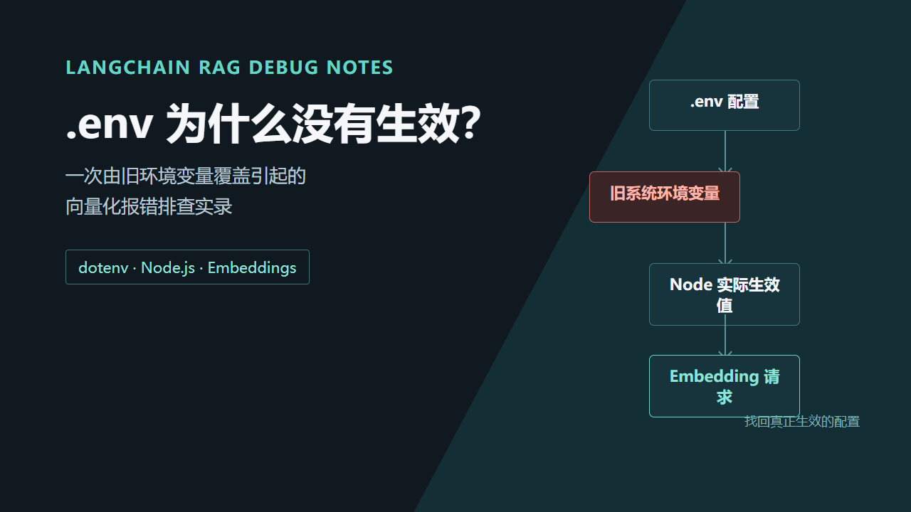
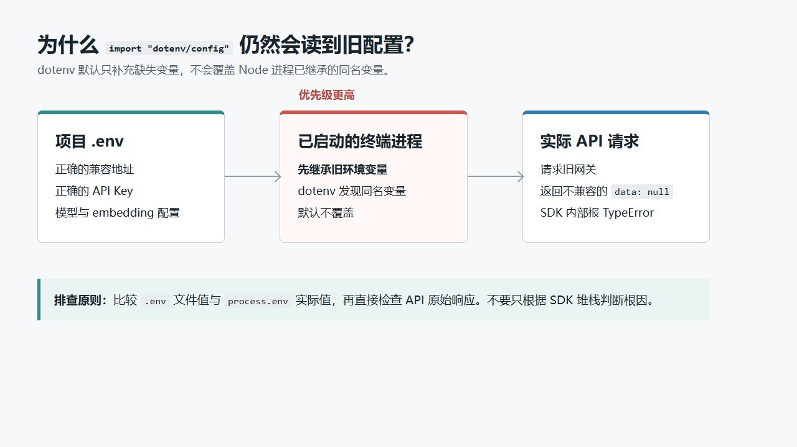

# LangChain RAG 排错实录：.env 为什么没有生效

> 同一份 `.env`，老师能跑，我却在 `OpenAIEmbeddings` 里拿到了 `null`。最后发现，问题既不在切片逻辑，也不在 LangChain，而在一个比 `.env` 优先级更高的旧环境变量。



我在练习一个很小的 RAG 流程：抓取一篇网页文章，切成多个 chunk，写入内存向量库，再检索并让模型回答问题。流程不复杂，但第一次跑到“创建向量存储”就报错了：

```text
TypeError: Cannot read properties of null (reading '0')
    at OpenAIEmbeddings.embedDocuments (.../embeddings.js:86:75)
```

这篇文章记录完整的排查路径。它不只是一次 API Key 问题，更是一次关于 **Node.js 环境变量优先级** 的实战复盘。

## 先看这个 RAG 小项目在做什么

项目使用 ESM，入口文件一开始就加载了 dotenv：

```js
import "dotenv/config";

import { CheerioWebBaseLoader } from "@langchain/community/document_loaders/web/cheerio";
import { RecursiveCharacterTextSplitter } from "@langchain/textsplitters";
import { MemoryVectorStore } from "@langchain/classic/vectorstores/memory";
import { ChatOpenAI, OpenAIEmbeddings } from "@langchain/openai";
```

后面的主链路可以概括为：

```text
网页 URL
  -> CheerioWebBaseLoader 提取指定段落
  -> RecursiveCharacterTextSplitter 递归切分
  -> OpenAIEmbeddings 生成向量
  -> MemoryVectorStore 建库与检索
  -> ChatOpenAI 根据检索片段回答问题
```

这里的 `RecursiveCharacterTextSplitter` 配置了 `chunkSize: 400` 和 `chunkOverlap: 100`。它会优先按中文句末标点切分，无法自然切开时才继续尝试更细的边界。网页抓取和文档切分都成功了，日志显示“文档分割完成，共 9 个 chunks”。

所以，故障范围已经可以缩小：**问题发生在第一笔 embedding 请求，而不是 loader 或 splitter。**

## 这个 TypeError 为什么容易把人带偏

报错位置在依赖内部：

```js
embeddings.push(batchResponse[j].embedding);
```

表面上看是 LangChain 对 `null` 做了数组访问。很多人会立刻怀疑：

- chunk 是不是空了？
- embedding 模型名是不是写错了？
- LangChain 版本是不是不兼容？

这些方向不能说完全没有可能，但先改代码只会扩大变量。更有价值的问题是：**`batchResponse` 为什么会是 `null`？**

答案要到 API 的原始响应里找，而不是停在 SDK 的最后一层报错里。

## 直接请求 embedding 接口，看到真实响应

我写了一个只发一条 embedding 请求的最小检查脚本。注意：日志只打印状态和结果形状，绝不打印完整 Key。

```js
import "dotenv/config";

const base = process.env.OPENAI_BASE_URL.endsWith("/")
  ? process.env.OPENAI_BASE_URL
  : `${process.env.OPENAI_BASE_URL}/`;

const response = await fetch(`${base}embeddings`, {
  method: "POST",
  headers: {
    "Content-Type": "application/json",
    Authorization: `Bearer ${process.env.OPENAI_API_KEY}`,
  },
  body: JSON.stringify({
    model: process.env.EMBEDDINGS_MODEL_NAME,
    input: "test",
  }),
});

const body = await response.json();
console.log({
  status: response.status,
  hasEmbedding: typeof body.data?.[0]?.embedding?.[0] === "number",
  error: body.error?.message ?? body.msg ?? null,
});
```

原始响应不是 OpenAI 兼容的 embedding 结构，而是：

```json
{
  "code": 0,
  "msg": "旧转发链路已关闭",
  "data": null
}
```

这就解释了依赖内部的 `TypeError`：SDK 期待 `data` 是向量数组，网关却返回了 `null`，并且错误地使用了 HTTP `200`。也就是说，HTTP 成功并不代表业务请求成功。

## 根因：`.env` 被已存在的环境变量覆盖了

我原本以为老师给的 `.env` 没有被读取，但 `index.mjs` 的第一行明明写了：

```js
import "dotenv/config";
```

关键在于 dotenv 的默认行为：**只填充不存在的变量，不覆盖当前进程已经存在的变量。**

环境变量大致可以这样理解：



我的 `.env` 中是可用的百炼兼容地址和对应 Key；但 Windows 的用户环境变量里残留了旧的 `OPENAI_BASE_URL` 与 `OPENAI_API_KEY`。Node 启动时先继承了它们，dotenv 发现同名变量已经存在，就保留旧值。

于是代码实际请求的是旧网关，不是 `.env` 中的服务。

## 不要猜：比较“文件值”和“实际生效值”

下面这个检查可以快速确认是否发生覆盖。它不会输出 Key 本文，只比较是否一致：

```js
import fs from "node:fs";
import dotenv from "dotenv";

const fileEnv = dotenv.parse(fs.readFileSync(".env"));
await import("dotenv/config");

for (const key of [
  "OPENAI_BASE_URL",
  "OPENAI_API_KEY",
  "MODEL_NAME",
  "EMBEDDINGS_MODEL_NAME",
]) {
  console.log(`${key}: ${fileEnv[key] === process.env[key]}`);
}
```

如果 `OPENAI_BASE_URL` 或 `OPENAI_API_KEY` 输出 `false`，就不要继续改 LangChain 代码了。先处理配置来源。

在 PowerShell 中，也可以查看当前会话：

```powershell
Get-ChildItem Env:OPENAI_*
```

查看用户级持久配置：

```powershell
[Environment]::GetEnvironmentVariable("OPENAI_BASE_URL", "User")
[Environment]::GetEnvironmentVariable("OPENAI_API_KEY", "User")
```

## 解决方案：先让当前终端不再继承旧值

为了不影响其他项目，可以先在**当前 PowerShell 窗口**清空旧变量：

```powershell
Remove-Item Env:OPENAI_BASE_URL -ErrorAction SilentlyContinue
Remove-Item Env:OPENAI_API_KEY -ErrorAction SilentlyContinue

node src/index.mjs
```

这只影响当前终端。关闭窗口后，持久环境变量仍会重新被继承。

如果确认旧变量已经不再被任何项目使用，再到 Windows 的“编辑账户的环境变量”中删除用户变量里的：

```text
OPENAI_BASE_URL
OPENAI_API_KEY
```

删除后要完整重启 VS Code、终端或其他运行 Node 的编辑器。原因很简单：已经启动的父进程会保留启动时的环境；即使你删掉了 Windows 用户变量，旧进程创建的新终端也可能继续继承旧值。

## 第二类错误：401 才是真正的 API Key 问题

清理旧网关后，错误可能变成：

```text
401 Incorrect API key provided
code: invalid_api_key
```

这个错误和前面的 `TypeError` 完全不是一回事：

| 现象 | 请求实际到达的位置 | 优先排查方向 |
| --- | --- | --- |
| `data: null`，SDK 内部 TypeError | 已关闭或不兼容的代理网关 | `OPENAI_BASE_URL` 被覆盖、服务响应格式 |
| `401 invalid_api_key` | 已到达目标模型服务 | Key 是否复制完整、过期、撤销或属于错误的服务商 |
| `429 insufficient_quota` | 已通过认证 | 账户余额、额度或消费上限 |
| `model_not_found` / `403` | 已到达目标模型服务 | 模型名称、项目权限、组织配置 |

错误信息是排错路线图。不要把所有错误都归结为“Key 没连上”。

## 要不要在代码里强制覆盖？

dotenv 支持：

```js
import dotenv from "dotenv";
dotenv.config({ override: true });
```

它可以让 `.env` 覆盖当前进程环境变量。但这不一定适合所有项目：部署平台、CI 和容器经常故意通过运行环境注入生产 Key，此时强制覆盖反而可能让本地 `.env` 覆盖生产配置。

更稳妥的习惯是：

1. 本地练习项目把 Key 放进 `.env`，并确保 `.env` 已写进 `.gitignore`。
2. 不要在 Windows 用户环境变量中长期放同名的项目专用 Key。
3. 排错时打印“是否存在、是否一致、长度或指纹”，不要打印密钥原文。
4. 对第三方兼容网关，额外检查响应是否真的是 OpenAI 兼容格式。

## 结语

这次排错最大的收获不是“删掉两个环境变量”，而是建立了一个顺序：

```text
先定位出错阶段
  -> 再看原始 API 响应
  -> 比较 .env 与 process.env
  -> 最后才判断 Key、额度或模型权限
```

RAG 的 loader、切分、向量化和检索看起来是一条业务链，实际每一段都依赖配置和外部服务。遇到依赖内部的模糊错误，先把请求链路拆开，通常比盯着堆栈反复改代码更快。

---

**相关技术：** `LangChain`、`Node.js`、`dotenv`、`RAG`、`OpenAI Embeddings`、`阿里云百炼`
