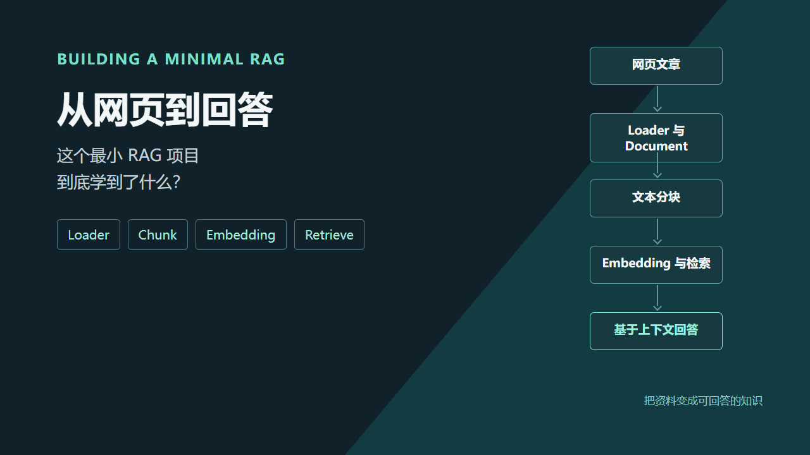
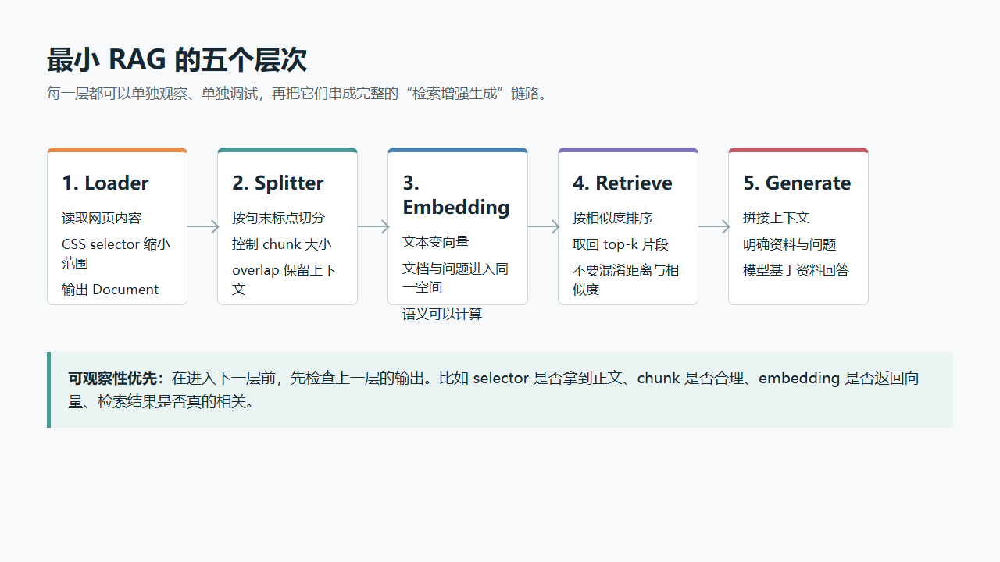

# 从网页到回答：这个最小 RAG 项目学到了什么

> 把一篇网页文章变成可以被提问的知识库，代码并不多；但从“能跑”到“理解 RAG”，中间至少要想清楚文档、分块、向量、检索和上下文这五件事。



我用一个小项目完成了这样一条链路：抓取掘金文章中的段落，按语义切成小块，把文本变成向量放进内存，然后用问题检索最相关的片段，最后交给模型生成回答。

项目文件不多，核心入口只有一个 `src/index.mjs`。正因为足够小，它特别适合把 RAG 的基本部件逐一拆开理解。

## 先把全流程画出来

```text
网页 URL
  -> Loader 读取并抽取正文
  -> Document 标准化
  -> Text Splitter 语义分块
  -> Embeddings 文本向量化
  -> Vector Store 保存与检索
  -> Retriever 取回相关上下文
  -> Chat Model 基于上下文回答
```



这条链路里，LLM 并没有“记住”网页内容。每次提问时，系统先把问题变成向量，再从已经向量化的文本块中找相近内容，最后把这些内容拼进提示词中。这就是 Retrieval-Augmented Generation，检索增强生成。

## 1. Loader：先把不同来源统一成 Document

知识库的来源不止网页：PDF、Word、Markdown、本地文件、数据库记录，甚至视频字幕都可能成为资料。RAG 的第一步不是直接喂给模型，而是把资料转换成统一的 `Document` 形态。

当前项目使用 `CheerioWebBaseLoader`：

```js
import { CheerioWebBaseLoader } from "@langchain/community/document_loaders/web/cheerio";

const loader = new CheerioWebBaseLoader(articleUrl, {
  selector: ".main-area p",
});

const documents = await loader.load();
```

一个 `Document` 的核心字段是：

```js
{
  pageContent: "正文文本",
  metadata: {
    source: "原始链接",
    title: "文章标题"
  }
}
```

`pageContent` 负责后续分块与向量化，`metadata` 负责溯源。没有来源信息的知识库很难调试，也很难让回答带引用。

这里还有一个很实用的学习动作：项目里的 `test-selector.mjs` 会依次测试多个 CSS selector，并打印文档数量与文本长度。网页结构随时可能改变，先验证 selector 是否真的提取到正文，比盲目怀疑向量模型更有效。

## 2. 分块：不是按字数切一刀那么简单

一整篇文章直接生成一个向量，检索粒度太粗；切得过碎，又会丢掉上下文。因此 chunk 的目标是：**大小可控，同时尽量保存完整语义。**

项目使用递归字符切分器：

```js
import { RecursiveCharacterTextSplitter } from "@langchain/textsplitters";

const splitter = new RecursiveCharacterTextSplitter({
  chunkSize: 400,
  chunkOverlap: 100,
  separators: ["。", "！", "？"],
});

const chunks = await splitter.splitDocuments(documents);
```

几个参数的作用可以这样理解：

| 参数 | 当前值 | 作用 |
| --- | ---: | --- |
| `chunkSize` | `400` | 目标文本块大小，控制检索粒度与上下文成本 |
| `separators` | 中文句末标点 | 优先在自然语义边界处分块 |
| `chunkOverlap` | `100` | 相邻块保留重叠，减轻信息恰好落在边界上的问题 |

递归的意思不是“必定按所有符号切一遍”，而是优先按更理想的分隔符尝试。只有当前边界无法满足块大小时，才继续尝试下一层。对中文文章来说，先按句末标点切通常比按字符硬切更自然。

## 3. Embedding：让“意思接近”变成可计算的距离

文本本身无法直接做语义检索。Embedding 模型会把一段文字映射成一串浮点数，也就是向量：

```js
const embeddings = new OpenAIEmbeddings({
  apiKey: process.env.OPENAI_API_KEY,
  model: process.env.EMBEDDINGS_MODEL_NAME,
  configuration: {
    baseURL: process.env.OPENAI_BASE_URL,
  },
});
```

建库时，切分后的每个 chunk 都会调用 `embedDocuments`；提问时，问题会调用 `embedQuery`。因为两者位于同一个向量空间里，系统就能比较“`fs 模块有哪些 API`”与各个文本块的语义接近程度。

这里有一个容易混淆的点：聊天模型和 embedding 模型职责不同。

| 模型 | 在项目中的职责 |
| --- | --- |
| `OpenAIEmbeddings` | 将文档和问题转成向量，用于检索 |
| `ChatOpenAI` | 读取检索出的上下文，组织自然语言回答 |

如果只调用聊天模型，模型看不到网页原文；如果只调用 embedding 模型，系统能找到资料，却不会组织答案。二者配合才构成最小 RAG。

## 4. Vector Store：练习项目也需要一层检索接口

项目用的是 `MemoryVectorStore`：

```js
import { MemoryVectorStore } from "@langchain/classic/vectorstores/memory";

const vectorStore = await MemoryVectorStore.fromDocuments(
  chunks,
  embeddings,
);
```

它把向量和对应的文本、元数据保存在 Node 进程内存里。优点是零部署、概念直观；限制也同样明显：进程重启后数据消失，数据量大时需要全量扫描，不适合作为生产知识库。

因此可以把它理解为 RAG 的“实验台”。当数据规模、持久化、过滤条件或并发需求上来之后，再考虑 Chroma、pgvector、Milvus、Qdrant 等真正的向量数据库。

## 5. Retriever：向量库不直接等于上下文

向量库负责存和找，Retriever 则负责把“找什么、取多少条”包装成更接近业务的接口：

```js
const retriever = vectorStore.asRetriever({ k: 3 });
const docs = await retriever.invoke(question);
```

这里的 `k: 3` 是一个取舍：

- 太小，可能漏掉关键上下文；
- 太大，会把不相关内容塞进 prompt，增加 token 成本，也会干扰回答。

一个实用的起点是先观察 top-k 结果，再根据问题类型和 chunk 大小调参。不要一开始就把 `k` 设得很大。

## 6. 分数不是“越小越相似”：读实现比读注释可靠

项目还调用了：

```js
const results = await vectorStore.similaritySearchWithScore(question, 3);
```

代码随后用 `1 - score` 再把结果打印为“相似度”。这里需要特别小心：当前版本的 `MemoryVectorStore` 默认使用余弦相似度，并按**相似度从大到小**排序。也就是说，它返回的 `score` 本身已经是“越大越相关”的相似度。

因此在这个实现里：

```js
const similarity = score;
```

语义才是对的；`1 - score` 更像把它转换成距离式数值，不能继续叫相似度。

这不是说所有向量库都一样。不同数据库和不同 API 可能返回余弦相似度、余弦距离、内积或欧氏距离。展示分数前，最好查实际实现或官方文档，不要只凭变量名猜含义。

## 7. Augment：把检索结果变成模型真正看得到的上下文

检索结果只是 `Document[]`，还需要显式拼入 prompt：

```js
const context = docs
  .map((doc, index) => `[片段${index + 1}]\n${doc.pageContent}`)
  .join("\n\n-----\n\n");

const prompt = `
你是一个文章辅助阅读助手，根据文章内容来解答。
文章内容：
${context}

问题：${question}
你的回答：`;

const response = await model.invoke(prompt);
```

这一步就是 Augmented。好的上下文格式至少应做到两件事：

1. 明确告诉模型哪些是资料、哪些是问题；
2. 保留片段编号或来源，方便回答时引用和排错。

进一步可以加入规则：资料不足时承认不知道、回答后标注来源、限制回答只能依据上下文。它们都是降低幻觉的常见手段。

## 从这个项目带走的 5 个知识点

1. **Document 是 RAG 的统一输入层。** 不同资料先标准化，后面的分块、向量化与检索才可复用。
2. **Chunk 是检索效果的基础。** chunkSize、分隔符和 overlap 共同决定“找到什么”。
3. **Embedding 与聊天模型不是替代关系。** 前者负责找，后者负责答。
4. **Retriever 的 top-k 是上下文预算。** 不是越大越好，需要结合问题与文本块观察结果。
5. **分数与配置都要看真实值。** 向量分数先确认指标含义；API 报错先看原始响应与实际生效的环境变量。

## 下一步可以怎么扩展

这个最小项目已经包含 RAG 的骨架，后续可以沿三个方向升级：

```text
资料侧：支持 PDF / Markdown / 本地目录，增加清洗和元数据
检索侧：持久化向量库、metadata 过滤、MMR 或 rerank
回答侧：引用来源、对话记忆、流式输出、无资料时的拒答策略
```

最重要的是保持顺序：先让“网页 -> chunk -> 向量 -> 命中片段”每一步都可观察，再叠加更复杂的 Agent、工具调用或多轮对话。RAG 的效果，往往先由资料处理和检索质量决定，而不是由 prompt 写得多长决定。

---

**相关技术：** `LangChain`、`Node.js`、`Cheerio`、`Text Splitter`、`Embedding`、`Vector Store`、`RAG`
